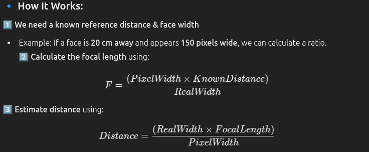

# Measuring the Distance of Faces Using OpenCV

### 1. Import Required Libraries
```python
import cv2
import numpy as np
```

### 2. Load the Face Detection Model
We will use a pre-trained Haar Cascade classifier for face detection.
```python
face_cascade = cv2.CascadeClassifier(cv2.data.haarcascades + 'haarcascade_frontalface_default.xml')
```

### 3. Capture Video from Camera
```python
cap = cv2.VideoCapture(0)  # Use 0 for the default camera
```

### 4. Define the Focal Length and Known Width
To calculate the distance, we need the focal length of the camera and the known width of the face.
```python
KNOWN_WIDTH = 14.0  # Average width of a human face in centimeters
FOCAL_LENGTH = 700  # This value should be calibrated for your camera
```

### 5. Calculate Distance Function
```python
def calculate_distance(known_width, focal_length, per_width):
    return (known_width * focal_length) / per_width
```

### 6. Detect Faces and Calculate Distance
```python
while True:
    ret, frame = cap.read()
    gray = cv2.cvtColor(frame, cv2.COLOR_BGR2GRAY)
    faces = face_cascade.detectMultiScale(gray, 1.3, 5)
    
    for (x, y, w, h) in faces:
        cv2.rectangle(frame, (x, y), (x+w, y+h), (255, 0, 0), 2)
        distance = calculate_distance(KNOWN_WIDTH, FOCAL_LENGTH, w)
        cv2.putText(frame, f"Distance: {distance:.2f} cm", (x, y-10), cv2.FONT_HERSHEY_SIMPLEX, 0.5, (255, 0, 0), 2)
    
    cv2.imshow('frame', frame)
    if cv2.waitKey(1) & 0xFF == ord('q'):
        break

cap.release()
cv2.destroyAllWindows()
```

## Conclusion
By following these steps, you can measure the distance of faces from the camera using OpenCV. This technique can be useful in various applications such as security systems, human-computer interaction, and more.


